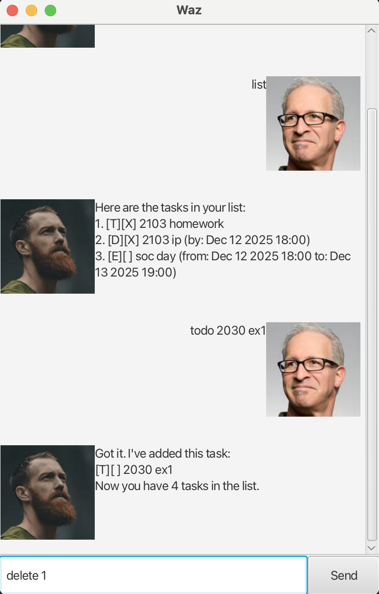

# Waz - Your Personal Todo Chatbot 🤖

>  "Your mind is for having ideas, not holding them." - David Allen

Meet **Waz**, a friendly text-based chatbot that helps you managed your tasks with ease.
It's simple, fast and ~~stressful~~ STRESS-FREE to use!

---

---
## What Waz Can Do
- Exit gracefully by saying bye 👋
- View all tasks
- Add todo tasks
- Add events with date and time
- Add deadlines with date and time ⏰
- Add tags to a task
- Mark and unmark tasks as done ✅
- Delete tasks 🗑️
- Find task by keyword 🔎
---
## 🚀 Commands
All commands are case insensitive. Index refers to the task number shown in the displayed list.

---
## 🚪 Exit
Safely shut down the app. (auto-saves before exit).

**Command:** `bye`

**Example:** 
- `bye` - 👋🏻 Exits the program.

---
## 📋View All Tasks
Show a list of a tasks

**Command:** `list`

**Example:**
- `list` - show all tasks with their indexes.

---
## ✏️ Add a To-Do Task
Add a task with no deadlines

**Command:** `todo TASK_NAME`

**Example:**
- `todo study math` - Adds a to-do task named "study math".

---
## ⏰ Add a Deadline Task
Add tasks with deadlines.

**Command:** `deadline TASK_NAME /by DateTime`

**Example:**
- `deadline submit report /by 2025-12-12 1800` -> Due by 6pm

> 💡 **Tip:** Supported date formats
>- `yyyy-MM-dd HHmm` → `2025-12-12 1800`
>- `yyyy-MM-dd HH:mm` → `2025-12-12 18:00`
>- `dd/MM/yyyy HHmm` → `12/12/2025 1800`
>- `dd/MM/yyyy HH:mm` → `12/12/2025 18:00`
>- `MMM dd yyyy HH:mm` → `Dec 12 2025 18:00`

---
## 🎃️ Add an Event Task
Schedule events with start and end times.

**Command:** `event TASK_NAME /from START_DATETIME /to END_DATETIME`

**Example:**
- `event team meeting /from 2025-09-09 0900 /to 2025-09-09 2300` -> 9 AM to 11 PM

---
## 🏷️Add a tag
Add tags to a task

**Command:** `tag INDEX #TAG`

**Example:**
- `tag 1 #School` - Adds the tag `#School` to task 2
- `tag 1 #Urgent` - Adds the tag `#Urgent` to task 2

Now task 2 has both tags: `#School`, `#Urgent`

---
## ✅ Mark a Task as Done
Mark a task as completed

**Command:** `mark INDEX`

**Example:**
- `mark 2` - Marks the 2nd task as completed.

---
## ❌ Unmark a Task as Not Done
Unmark a task as not completed.

**Command:** `unmark INDEX`

**Example:**
- `unmark 1` - Unmark the 1st task as not completed.

---
## 🗑️ Delete a Task
Remove task from the list

**Command:** `delete INDEX`

**Example:**
- `delete 1` - Remove the first task.

---
## 🔎 Search for Tasks
Find tasks by keyword (Case-Insensitive!)

**Command:** `find KEYWORD`

**Example:**
- `find math` - Shows "Study math", "Math 1".

---
## 🛟Auto-save Data
Every change made is automatically saved into your disk.

**Filename:** `waz.txt`

---

## Command Summary
## 📋 Command Summary

| Action              | Command & Example                                              |
|---------------------|----------------------------------------------------------------|
| Exit Program        | `bye`                                                          |
| List All Tasks      | `list`                                                         |
| Add To-Do           | `todo study math`                                              |
| Add Deadline        | `deadline submit report /by 2025-12-12 1800`                   |
| Add Event           | `event team meeting /from 2025-09-09 0900 /to 2025-09-09 2300` |
| Add Tag             | `tag 2 #urgent`                                                |
| Mark Done           | `mark 2`                                                       |
| Unmark Task         | `unmark 1`                                                     |
| Delete Task         | `delete 1`                                                     |
| Find Tasks          | `find math`                                                    |
Current version - **v0.2**
